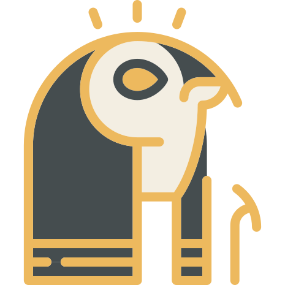

# Horus

Play NES games in your browser. Bring your favorite games, build your own library, and play with a keyboard or gamepad—with a friend beside you for games that support two players.

You can Play on https://imdhemy.com/horus

Use game files you have permission to use. Some games may not be supported by the emulator.

## Your library

Games you add are stored in your browser on that device; importing them does not upload them to a server. Return using the same browser and site to find them again.

Your library does not sync between browsers or devices. Clearing the site's browser data removes your imported games and saved control preferences, so keep the original game files on your computer. Removing a game from Horus leaves the original file untouched.

## Credits

Horus is maintained by Dhemy and built on [JSNES](https://github.com/bfirsh/jsnes), originally created by Ben Firshman. JSNES builds on James Sanders' [vNES](https://github.com/bfirsh/vNES), with inspiration from Matt Wescott's [JSSpeccy](https://jsspeccy.zxdemo.org/).

See [AUTHORS.md](AUTHORS.md) for contributor credits.
